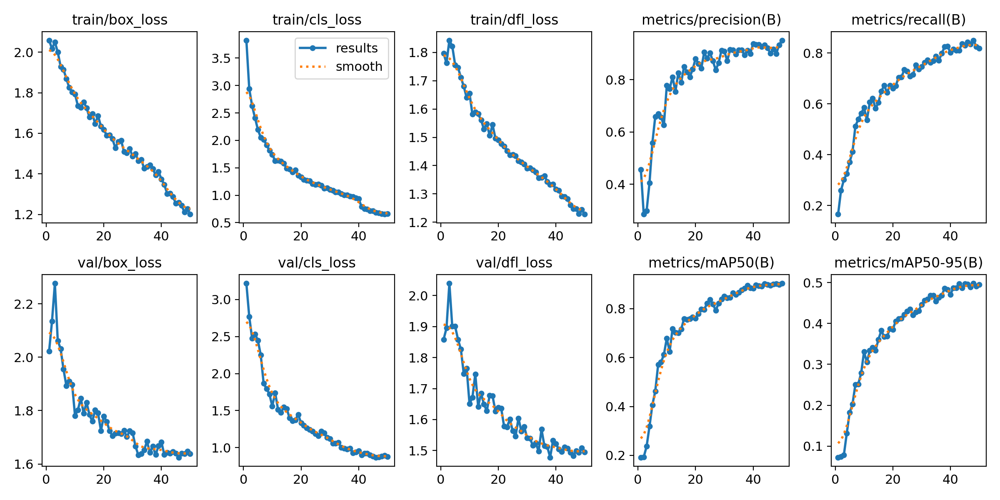
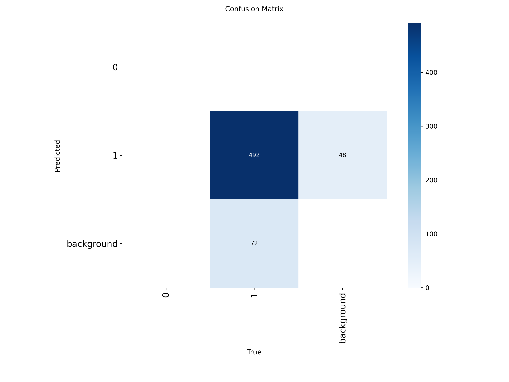

# Armed/Unarmed Person Detection System

Real-time threat detection system that classifies people as armed or unarmed using computer vision.

## What it does
- Detects human faces in real-time using OpenCV Haar Cascades
- Detects firearms using a custom trained YOLOv8 model
- Correlates gun detections with people using IoU-based spatial overlap
- Labels each person as ARMED (red) or UNARMED (green) in real time
- Estimates body area from face position to improve gun-person correlation

## Demo
- Green box = Unarmed person
- Red box = Armed person  
- Orange box = Detected firearm with confidence score

## Tech Stack
- Python 3.11
- YOLOv8 (Ultralytics) — custom trained gun detector
- OpenCV — face detection + video processing
- Haar Cascade Classifier — frontal face detection

## How it works
1. Every frame is passed through two models simultaneously
2. OpenCV detects faces and estimates full body bounding box
3. YOLOv8 detects firearms with confidence filtering (>0.5)
4. IoU overlap check determines if a gun is associated with a person
5. Person is labeled ARMED if any gun box overlaps their body area

## Model Training
- Base model: YOLOv8n pretrained weights
- Dataset: Custom gun detection dataset from Roboflow
- Epochs: 50
- Hardware: NVIDIA RTX 3060 Laptop GPU
- Final mAP50: 0.80+
  
## Model Training

Custom YOLOv8 gun detector trained from scratch on labeled firearm dataset.

### Dataset
- Source: Roboflow Universe (Gun Detection dataset)
- Classes: gun
- Format: YOLOv8

### Training Configuration
| Parameter | Value |
|-----------|-------|
| Base model | YOLOv8n |
| Epochs | 50 |
| Image size | 640x640 |
| Batch size | 16 |
| Hardware | NVIDIA RTX 3060 Laptop GPU |
| Training time | ~1 hour |

### Results

### How to retrain
pip install ultralytics roboflow
py -3.11 train.py
## How to run
pip install -r requirements.txt
py -3.11 detect.py

## Requirements
- Python 3.11
- NVIDIA GPU recommended
- Webcam

## Use Cases
- Security surveillance systems
- Threat detection in public spaces
- Law enforcement assistance tools
- Safety monitoring systems

## Future Improvements
- Add multi-camera support
- Log all detections to database
- Build web dashboard for live monitoring
- Improve gun detection accuracy with larger dataset
- Add alert system for armed detections

## Skills Demonstrated
`Python` `Computer Vision` `Deep Learning` `YOLOv8` `OpenCV` `Custom Model Training` `Object Tracking` `CUDA/GPU`
